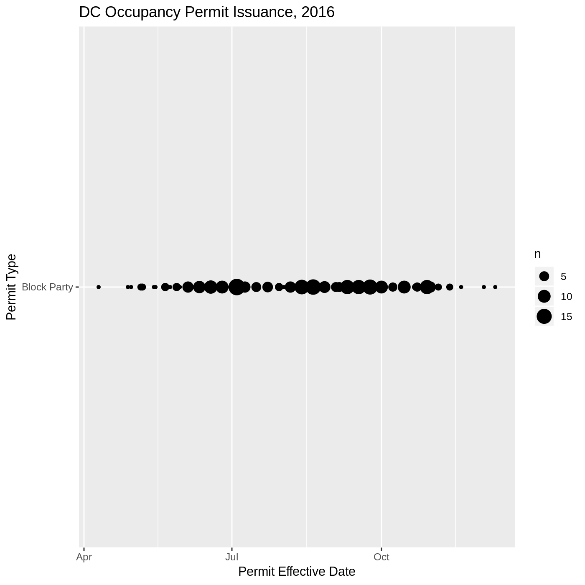
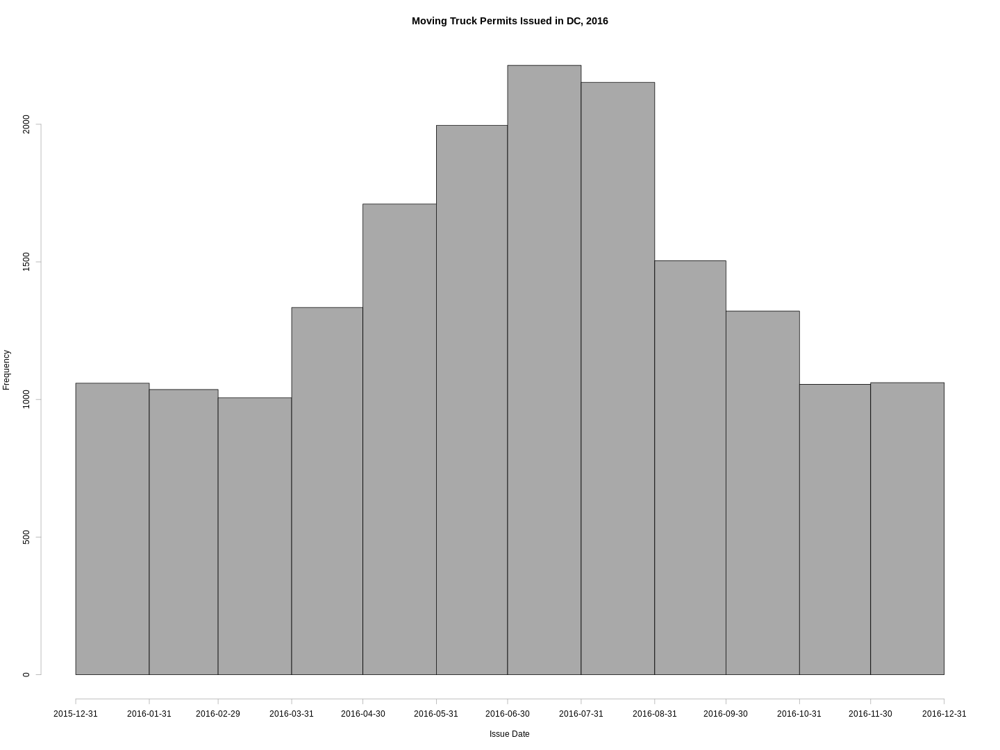

Shiny App Pitch: Exploring DC's Permitting Issuance
========================================================
author: Kevin Cole
date: March 8, 2019
autosize: true
font-family: 'Roboto'

Visualizing DC Occupancy Permits
========================================================

This Shiny app allows users to quickly visualize patterns in the issuance of Occupancy Permits (permits for using the district's public spaces) in Washington, DC with a histogram. The user can chose to display results grouped by week or month, and can also determine the type of permit being analyzed.




Cleaning the Data
========================================================

Some initial steps were necessary in order to clean the data of erroneous entries. These operations are shown below.


```r
## Remove Banner and Seasonal Display rows, as these were erroneously included in the data set.
cleanData <- processData[ which(processData$EVENTTYPESCODEDESC != "Banner and Seasonal Display"), ]

## Set the permit effective date to date class. 
cleanData$EFFECTIVEDATE <- as.Date(cleanData$EFFECTIVEDATE)
```

Example Plot
========================================================

Here is an example of one of the plots that can be generated with the Shiny app, clearly showing that the summer months of June/July are peak moving season in DC.



Data Source
=======================================================

The data used to produce this Shiny app is available from the District of Columbia's [OpenData initiative](opendata.dc.gov).

Check out the app here: [Explore DC Occupancy Permit Issuance, 2016](https://kcole93.shinyapps.io/DCPermits/).
